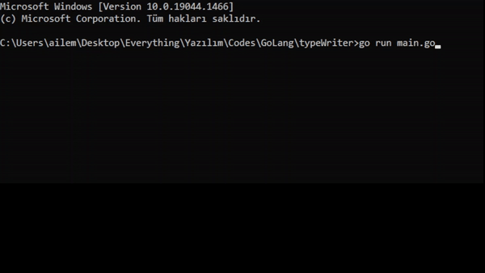

You can write slowly your words.
Type Writer function with golang

### Usage 1
Daktilo(text(string), milliseconds(int))

### Usage 2
Daktilo(text(string))

`go run main.go`

** Note: If you don't enter any parameter for milliseconds, the default value inside the function is used.

